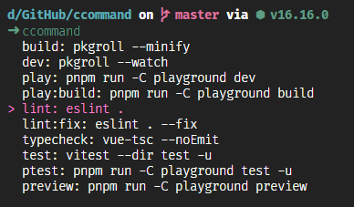
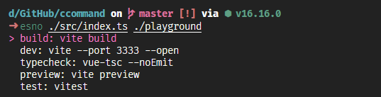

## ccommand
用命令选择需要执行的script, 支持直接选择子目录下的script来执行

## feature
兼容了yarn和npm的命令行工具


## 安装
```bash
npm i -g ccommand
```

## 使用
- ccommand # 默认当前目录



- ccommand ./playground # 执行子目录 playground 下的 script


